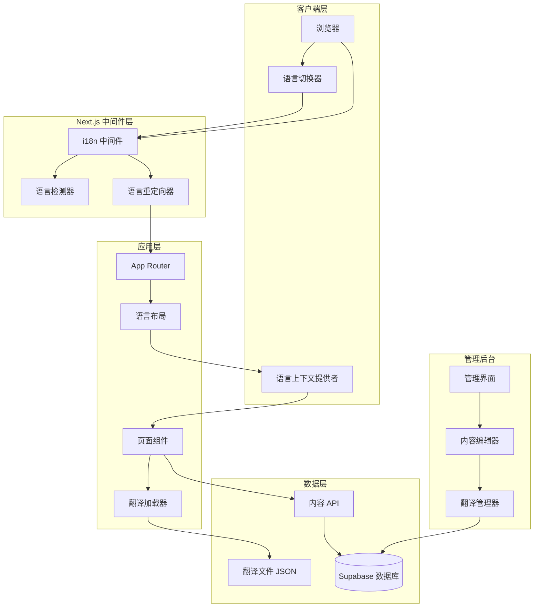

# 设计文档

## 概述

本文档描述了为 Next.js 网站实现多语言支持的技术设计方案。该系统将支持简体中文（zh-CN）、繁体中文（zh-TW）和英文（en）三种语言，采用 Next.js 14 App Router 的国际化最佳实践，结合服务端和客户端渲染，提供高性能的多语言体验。

设计目标：
- 使用 Next.js 14 App Router 的原生国际化支持
- 实现基于路由的语言切换（/[locale]/...）
- 支持静态和动态内容的多语言管理
- 优化 SEO 和性能
- 提供友好的内容管理界面

## 架构

### 系统架构图



### 技术栈

- **框架**: Next.js 14 (App Router)
- **国际化库**: next-intl
- **状态管理**: React Context + Zustand
- **数据库**: Supabase (PostgreSQL)
- **样式**: Tailwind CSS + Framer Motion
- **日期格式化**: date-fns
- **类型安全**: TypeScript

### 目录结构

```
src/
├── app/
│   ├── [locale]/                    # 语言路由组
│   │   ├── layout.tsx              # 语言布局
│   │   ├── page.tsx                # 首页
│   │   ├── about/                  # 关于页面
│   │   ├── services/               # 服务页面
│   │   ├── portfolio/              # 案例页面
│   │   ├── blog/                   # 博客页面
│   │   ├── contact/                # 联系页面
│   │   └── pricing/                # 价格页面
│   ├── admin/                      # 管理后台（不在语言路由下）
│   │   ├── articles/
│   │   ├── categories/
│   │   └── settings/
│   └── api/                        # API 路由
│       ├── articles/
│       └── translations/
├── components/
│   ├── LanguageSwitcher.tsx        # 语言切换器
│   ├── LocaleProvider.tsx          # 语言上下文
│   └── admin/
│       └── MultilingualEditor.tsx  # 多语言编辑器
├── i18n/
│   ├── config.ts                   # i18n 配置
│   ├── request.ts                  # 服务端 i18n
│   └── routing.ts                  # 路由配置
├── locales/                        # 翻译文件
│   ├── zh-CN/
│   │   ├── common.json
│   │   ├── home.json
│   │   ├── about.json
│   │   └── ...
│   ├── zh-TW/
│   └── en/
├── lib/
│   ├── i18n/
│   │   ├── utils.ts               # i18n 工具函数
│   │   └── types.ts               # i18n 类型定义
│   └── supabase/
│       └── i18n-schema.sql        # 数据库 schema
└── middleware.ts                   # Next.js 中间件
```

## 组件和接口

### 1. i18n 配置模块

#### i18n/config.ts

```typescript
export const locales = ['zh-CN', 'zh-TW', 'en'] as const;
export type Locale = (typeof locales)[number];

export const defaultLocale: Locale = 'zh-CN';

export const localeNames: Record<Locale, string> = {
  'zh-CN': '简体中文',
  'zh-TW': '繁體中文',
  'en': 'English',
};

export const localeFlags: Record<Locale, string> = {
  'zh-CN': '🇨🇳',
  'zh-TW': '🇹🇼',
  'en': '🇺🇸',
};

export const i18nConfig = {
  locales,
  defaultLocale,
  localePrefix: 'always' as const, // 总是显示语言前缀
  localeDetection: true, // 启用自动语言检测
};
```

#### i18n/routing.ts

```typescript
import { defineRouting } from 'next-intl/routing';
import { i18nConfig } from './config';

export const routing = defineRouting({
  locales: i18nConfig.locales,
  defaultLocale: i18nConfig.defaultLocale,
  localePrefix: i18nConfig.localePrefix,
});

export const { Link, redirect, usePathname, useRouter } = routing;
```

#### i18n/request.ts

```typescript
import { getRequestConfig } from 'next-intl/server';
import { routing } from './routing';

export default getRequestConfig(async ({ locale }) => {
  // 验证语言是否有效
  if (!routing.locales.includes(locale as any)) {
    return {
      locale: routing.defaultLocale,
      messages: {},
    };
  }

  return {
    locale,
    messages: (await import(`@/locales/${locale}/common.json`)).default,
  };
});
```

### 2. 中间件模块

#### middleware.ts

```typescript
import createMiddleware from 'next-intl/middleware';
import { NextRequest, NextResponse } from 'next/server';
import { routing } from './i18n/routing';

const i18nMiddleware = createMiddleware(routing);

export default function middleware(request: NextRequest) {
  const { pathname } = request.nextUrl;

  // 管理后台路径不应用 i18n 中间件
  if (pathname.startsWith('/admin') || pathname.startsWith('/api')) {
    // 保留原有的管理后台认证逻辑
    if (pathname.startsWith('/admin')) {
      const sessionCookie = request.cookies.get('admin_session');
      
      if (pathname === '/admin/login') {
        if (sessionCookie) {
          try {
            const sessionData = JSON.parse(sessionCookie.value);
            if (sessionData.adminId && sessionData.email) {
              const redirectTo = request.nextUrl.searchParams.get('redirect') || '/admin/dashboard';
              return NextResponse.redirect(new URL(redirectTo, request.url));
            }
          } catch (error) {
            const response = NextResponse.next();
            response.cookies.delete('admin_session');
            return response;
          }
        }
        return NextResponse.next();
      }

      if (!sessionCookie) {
        const loginUrl = new URL('/admin/login', request.url);
        loginUrl.searchParams.set('redirect', pathname);
        return NextResponse.redirect(loginUrl);
      }

      try {
        const sessionData = JSON.parse(sessionCookie.value);
        if (!sessionData.adminId || !sessionData.email) {
          throw new Error('Invalid session');
        }
        return NextResponse.next();
      } catch (error) {
        const loginUrl = new URL('/admin/login', request.url);
        loginUrl.searchParams.set('redirect', pathname);
        const response = NextResponse.redirect(loginUrl);
        response.cookies.delete('admin_session');
        return response;
      }
    }
    
    return NextResponse.next();
  }

  // 应用 i18n 中间件到前台路由
  const response = i18nMiddleware(request);
  
  // 设置语言 cookie（有效期 1 年）
  const locale = request.nextUrl.pathname.split('/')[1];
  if (routing.locales.includes(locale as any)) {
    response.cookies.set('NEXT_LOCALE', locale, {
      maxAge: 365 * 24 * 60 * 60, // 1 年
      path: '/',
    });
  }
  
  return response;
}

export const config = {
  matcher: [
    // 匹配所有路径，除了以下路径
    '/((?!_next|_vercel|.*\\..*).*)',
    // 包含 API 路由
    '/api/:path*',
  ],
};
```

### 3. 语言切换器组件

#### components/LanguageSwitcher.tsx

```typescript
'use client';

import { useState, useTransition } from 'react';
import { useLocale } from 'next-intl';
import { useRouter, usePathname } from '@/i18n/routing';
import { motion, AnimatePresence } from 'framer-motion';
import { Globe, Check, ChevronDown } from 'lucide-react';
import { locales, localeNames, localeFlags, type Locale } from '@/i18n/config';

export default function LanguageSwitcher() {
  const [isOpen, setIsOpen] = useState(false);
  const [isPending, startTransition] = useTransition();
  const locale = useLocale() as Locale;
  const router = useRouter();
  const pathname = usePathname();

  const handleLocaleChange = (newLocale: Locale) => {
    if (newLocale === locale) {
      setIsOpen(false);
      return;
    }

    startTransition(() => {
      router.replace(pathname, { locale: newLocale });
      setIsOpen(false);
    });
  };

  return (
    <div className="relative">
      <button
        onClick={() => setIsOpen(!isOpen)}
        disabled={isPending}
        className={`flex items-center gap-2 px-4 py-2 rounded-lg transition-all ${
          isPending
            ? 'opacity-50 cursor-not-allowed'
            : 'hover:bg-white/10'
        }`}
        aria-label="切换语言"
      >
        <Globe className="w-5 h-5" />
        <span className="hidden md:inline">{localeNames[locale]}</span>
        <ChevronDown
          className={`w-4 h-4 transition-transform ${
            isOpen ? 'rotate-180' : ''
          }`}
        />
      </button>

      <AnimatePresence>
        {isOpen && (
          <>
            {/* 背景遮罩 */}
            <div
              className="fixed inset-0 z-40"
              onClick={() => setIsOpen(false)}
            />

            {/* 下拉菜单 */}
            <motion.div
              initial={{ opacity: 0, y: -10, scale: 0.95 }}
              animate={{ opacity: 1, y: 0, scale: 1 }}
              exit={{ opacity: 0, y: -10, scale: 0.95 }}
              transition={{ duration: 0.2 }}
              className="absolute top-full right-0 mt-2 w-48 bg-gray-900 border border-white/20 rounded-xl shadow-2xl overflow-hidden z-50"
            >
              {locales.map((loc) => (
                <button
                  key={loc}
                  onClick={() => handleLocaleChange(loc)}
                  disabled={isPending}
                  className={`w-full flex items-center justify-between px-4 py-3 transition-colors ${
                    locale === loc
                      ? 'bg-blue-500/20 text-blue-400'
                      : 'hover:bg-white/5 text-gray-300'
                  } ${isPending ? 'opacity-50 cursor-not-allowed' : ''}`}
                >
                  <div className="flex items-center gap-3">
                    <span className="text-xl">{localeFlags[loc]}</span>
                    <span className="font-medium">{localeNames[loc]}</span>
                  </div>
                  {locale === loc && <Check className="w-5 h-5" />}
                </button>
              ))}
            </motion.div>
          </>
        )}
      </AnimatePresence>
    </div>
  );
}
```

### 4. 语言布局组件

#### app/[locale]/layout.tsx

```typescript
import { NextIntlClientProvider } from 'next-intl';
import { getMessages, getTranslations } from 'next-intl/server';
import { notFound } from 'next/navigation';
import { routing } from '@/i18n/routing';
import NavbarEnhanced from '@/components/NavbarEnhanced';
import FooterEnhanced from '@/components/FooterEnhanced';
import { locales, type Locale } from '@/i18n/config';

export function generateStaticParams() {
  return locales.map((locale) => ({ locale }));
}

export async function generateMetadata({
  params: { locale },
}: {
  params: { locale: Locale };
}) {
  const t = await getTranslations({ locale, namespace: 'metadata' });

  return {
    title: {
      template: `%s | ${t('siteName')}`,
      default: t('siteTitle'),
    },
    description: t('siteDescription'),
    alternates: {
      canonical: `/${locale}`,
      languages: {
        'zh-CN': '/zh-CN',
        'zh-TW': '/zh-TW',
        'en': '/en',
      },
    },
  };
}

export default async function LocaleLayout({
  children,
  params: { locale },
}: {
  children: React.ReactNode;
  params: { locale: Locale };
}) {
  // 验证语言是否有效
  if (!routing.locales.includes(locale as any)) {
    notFound();
  }

  // 加载翻译消息
  const messages = await getMessages();

  return (
    <html lang={locale}>
      <body>
        <NextIntlClientProvider messages={messages}>
          <NavbarEnhanced />
          <main className="min-h-screen">{children}</main>
          <FooterEnhanced />
        </NextIntlClientProvider>
      </body>
    </html>
  );
}
```

### 5. 翻译工具函数

#### lib/i18n/utils.ts

```typescript
import { useTranslations } from 'next-intl';
import { format } from 'date-fns';
import { zhCN, zhTW, enUS } from 'date-fns/locale';
import { type Locale } from '@/i18n/config';

// 日期格式化
export function formatDate(
  date: Date | string,
  locale: Locale,
  formatStr: string = 'PPP'
): string {
  const dateObj = typeof date === 'string' ? new Date(date) : date;
  
  const localeMap = {
    'zh-CN': zhCN,
    'zh-TW': zhTW,
    'en': enUS,
  };

  return format(dateObj, formatStr, { locale: localeMap[locale] });
}

// 数字格式化
export function formatNumber(
  value: number,
  locale: Locale,
  options?: Intl.NumberFormatOptions
): string {
  return new Intl.NumberFormat(locale, options).format(value);
}

// 货币格式化
export function formatCurrency(
  value: number,
  locale: Locale,
  currency: string = 'CNY'
): string {
  return new Intl.NumberFormat(locale, {
    style: 'currency',
    currency,
  }).format(value);
}

// 获取翻译键的类型安全包装
export function useTypedTranslations<T extends string>(namespace: T) {
  return useTranslations(namespace);
}

// 回退翻译
export function getTranslationWithFallback(
  translations: Record<Locale, string>,
  locale: Locale,
  fallbackLocale: Locale = 'zh-CN'
): string {
  return translations[locale] || translations[fallbackLocale] || '';
}
```

## 数据模型

### 数据库 Schema 扩展

#### 文章表（articles）多语言字段

```sql
-- 为现有的 articles 表添加多语言支持
ALTER TABLE articles 
ADD COLUMN title_zh_tw TEXT,
ADD COLUMN title_en TEXT,
ADD COLUMN excerpt_zh_tw TEXT,
ADD COLUMN excerpt_en TEXT,
ADD COLUMN content_zh_tw TEXT,
ADD COLUMN content_en TEXT,
ADD COLUMN slug_zh_tw TEXT,
ADD COLUMN slug_en TEXT;

-- 添加索引
CREATE INDEX idx_articles_slug_zh_tw ON articles(slug_zh_tw);
CREATE INDEX idx_articles_slug_en ON articles(slug_en);

-- 添加约束：至少一种语言的标题必须存在
ALTER TABLE articles 
ADD CONSTRAINT check_title_exists 
CHECK (
  title IS NOT NULL OR 
  title_zh_tw IS NOT NULL OR 
  title_en IS NOT NULL
);
```

#### 分类表（categories）多语言字段

```sql
-- 为现有的 categories 表添加多语言支持
ALTER TABLE categories 
ADD COLUMN name_zh_tw TEXT,
ADD COLUMN name_en TEXT,
ADD COLUMN description_zh_tw TEXT,
ADD COLUMN description_en TEXT;
```

#### 标签表（tags）多语言字段

```sql
-- 为现有的 tags 表添加多语言支持
ALTER TABLE tags 
ADD COLUMN name_zh_tw TEXT,
ADD COLUMN name_en TEXT;
```

### TypeScript 类型定义

#### types/i18n.ts

```typescript
import { type Locale } from '@/i18n/config';

// 多语言内容接口
export interface MultilingualContent {
  zh_CN: string;
  zh_TW: string;
  en: string;
}

// 文章多语言接口
export interface MultilingualArticle {
  id: string;
  // 简体中文（默认）
  title: string;
  excerpt: string;
  content: string;
  slug: string;
  // 繁体中文
  title_zh_tw: string | null;
  excerpt_zh_tw: string | null;
  content_zh_tw: string | null;
  slug_zh_tw: string | null;
  // 英文
  title_en: string | null;
  excerpt_en: string | null;
  content_en: string | null;
  slug_en: string | null;
  // 其他字段
  author_id: string;
  category_id: string;
  published: boolean;
  created_at: string;
  updated_at: string;
}

// 获取本地化字段的辅助函数类型
export type LocalizedField<T> = {
  [K in keyof T]: T[K] extends string ? string : T[K];
};

// 翻译完整度状态
export interface TranslationCompleteness {
  locale: Locale;
  completed: boolean;
  missingFields: string[];
  completionPercentage: number;
}
```

## 正确性属性

*属性是一个特征或行为，应该在系统的所有有效执行中保持为真——本质上是关于系统应该做什么的正式陈述。属性作为人类可读规范和机器可验证正确性保证之间的桥梁。*

现在我将进行验收标准的测试性分析（prework）。


### 正确性属性

基于需求分析，以下是系统的核心正确性属性：

#### 属性 1：语言检测和默认设置

*对于任意*用户访问请求，如果没有语言 cookie，系统应该检测浏览器的 Accept-Language 头部并设置相应的语言；如果浏览器语言不在支持列表中，应该使用默认语言（简体中文）。

**验证需求：1.1, 8.3, 8.4**

#### 属性 2：语言偏好往返一致性

*对于任意*语言选择操作，将语言保存到 cookie 然后读取，应该得到相同的语言值，且 cookie 有效期应为 1 年。

**验证需求：1.4, 1.5, 8.1, 8.2, 8.5**

#### 属性 3：语言切换立即生效

*对于任意*语言切换操作，页面内容应该立即更新为所选语言，且 URL 应该包含正确的语言前缀。

**验证需求：1.3, 2.3**

#### 属性 4：路由和语言对应关系

*对于任意*带语言前缀的 URL 路径，系统应该加载对应语言的内容；对于无效的语言代码，应该重定向到默认语言。

**验证需求：2.2, 2.5**

#### 属性 5：翻译字典查找正确性

*对于任意*翻译键和语言组合，系统应该返回对应语言的翻译文本；如果翻译不存在，应该回退到默认语言的翻译。

**验证需求：3.2, 7.3, 7.5**

#### 属性 6：翻译回退机制一致性

*对于任意*缺失的翻译内容（静态或动态），系统应该始终回退到默认语言的内容，而不是显示错误或空白。

**验证需求：3.4, 7.4, 11.1, 11.3**

#### 属性 7：UI 组件翻译完整性

*对于任意*前台 UI 组件（导航、页脚、按钮等），所有文本内容都应该有对应语言的翻译。

**验证需求：3.5, 4.5**

#### 属性 8：语言切换器状态一致性

*对于任意*当前语言设置，语言切换器应该正确显示当前语言，且点击后应该展开包含所有可用语言的菜单。

**验证需求：4.1, 4.2**

#### 属性 9：SEO 元数据本地化

*对于任意*页面和语言组合，HTML 应该包含正确的 lang 属性、hreflang 标签、以及本地化的 meta 标签（title、description、OG、Twitter Card）。

**验证需求：5.1, 5.3, 5.4, 5.5**

#### 属性 10：多语言表单验证

*对于任意*内容保存操作，系统应该验证所有必填语言字段是否已填写；如果不完整，应该显示缺失翻译的语言列表。

**验证需求：6.3, 13.1, 13.3**

#### 属性 11：翻译完整度计算准确性

*对于任意*多语言内容，系统应该正确计算翻译完整度百分比，公式为：(已填写字段数 / 总必填字段数) × 100。

**验证需求：13.4**

#### 属性 12：本地化格式化一致性

*对于任意*日期、时间、数字或货币值，系统应该根据当前语言使用相应的格式化规则（日期格式、时间制式、千位分隔符、货币符号）。

**验证需求：9.1, 9.2, 9.3, 9.4**

#### 属性 13：资源加载优化

*对于任意*页面访问，系统应该只加载当前语言的翻译文件；切换语言时，应该动态加载新语言文件而不刷新页面。

**验证需求：10.1, 10.2**

#### 属性 14：翻译缓存有效性

*对于任意*已加载的翻译内容，再次访问相同翻译键时应该使用缓存，而不是重新加载。

**验证需求：10.4**

#### 属性 15：错误处理和日志记录

*对于任意*翻译加载失败的情况，系统应该回退到默认语言并在开发模式下记录警告日志。

**验证需求：11.2, 11.4**

#### 属性 16：后台界面语言独立性

*对于任意*管理员的界面语言切换，后台 UI 文本（菜单、按钮、标签、错误消息、通知）应该更新，但内容编辑区域的语言选择应该保持独立。

**验证需求：12.2, 12.3, 12.4, 12.5**

#### 属性 17：语言切换状态控制

*对于任意*语言切换操作，在切换过程中应该显示加载指示器并禁用切换器；如果切换失败，应该显示错误提示并保持当前语言。

**验证需求：14.1, 14.3, 14.4**

#### 属性 18：语言切换性能要求

*对于任意*语言切换操作，动画过渡时间不应超过 300 毫秒。

**验证需求：14.5**

## 错误处理

### 错误类型和处理策略

#### 1. 翻译缺失错误

**场景**：请求的翻译键不存在

**处理策略**：
- 回退到默认语言（zh-CN）的翻译
- 开发模式下在控制台输出警告
- 生产模式下静默回退，不影响用户体验

**实现**：
```typescript
function getTranslation(key: string, locale: Locale): string {
  const translation = translations[locale]?.[key];
  
  if (!translation) {
    if (process.env.NODE_ENV === 'development') {
      console.warn(`Translation missing: ${key} for locale ${locale}`);
    }
    return translations[defaultLocale][key] || key;
  }
  
  return translation;
}
```

#### 2. 语言文件加载失败

**场景**：网络错误或文件不存在导致翻译文件加载失败

**处理策略**：
- 回退到默认语言
- 显示用户友好的错误提示
- 记录错误日志用于监控

**实现**：
```typescript
async function loadTranslations(locale: Locale) {
  try {
    const translations = await import(`@/locales/${locale}/common.json`);
    return translations.default;
  } catch (error) {
    console.error(`Failed to load translations for ${locale}:`, error);
    
    // 回退到默认语言
    if (locale !== defaultLocale) {
      return loadTranslations(defaultLocale);
    }
    
    // 如果默认语言也失败，返回空对象
    return {};
  }
}
```

#### 3. 无效语言代码

**场景**：用户访问不支持的语言路径（如 /fr/about）

**处理策略**：
- 重定向到默认语言的相同路径
- 保留原始路径结构
- 设置正确的 HTTP 状态码（302）

**实现**：在中间件中已处理

#### 4. 数据库内容缺失

**场景**：某语言的动态内容（文章、分类等）不存在

**处理策略**：
- 显示默认语言的内容
- 在页面上标注当前显示的语言
- 提供切换到其他语言的选项

**实现**：
```typescript
async function getLocalizedContent(id: string, locale: Locale) {
  const content = await db.articles.findUnique({ where: { id } });
  
  if (!content) {
    throw new Error('Content not found');
  }
  
  // 尝试获取指定语言的内容
  const localizedTitle = getLocalizedField(content, 'title', locale);
  const localizedContent = getLocalizedField(content, 'content', locale);
  
  return {
    ...content,
    title: localizedTitle,
    content: localizedContent,
    displayLocale: localizedTitle === content.title ? defaultLocale : locale,
  };
}

function getLocalizedField(
  content: any,
  field: string,
  locale: Locale
): string {
  if (locale === defaultLocale) {
    return content[field];
  }
  
  const localizedField = `${field}_${locale.replace('-', '_')}`;
  return content[localizedField] || content[field];
}
```

#### 5. 表单验证错误

**场景**：管理员提交不完整的多语言内容

**处理策略**：
- 阻止提交
- 高亮显示缺失的字段
- 显示清晰的错误消息列表

**实现**：
```typescript
function validateMultilingualContent(data: MultilingualArticle) {
  const errors: Record<string, string[]> = {};
  const requiredFields = ['title', 'content'];
  
  for (const locale of locales) {
    const missingFields: string[] = [];
    
    for (const field of requiredFields) {
      const value = getLocalizedField(data, field, locale);
      if (!value || value.trim() === '') {
        missingFields.push(field);
      }
    }
    
    if (missingFields.length > 0) {
      errors[locale] = missingFields;
    }
  }
  
  return {
    isValid: Object.keys(errors).length === 0,
    errors,
  };
}
```

## 测试策略

### 测试方法

本项目采用双重测试策略，结合单元测试和属性测试，确保多语言功能的正确性和可靠性。

#### 1. 单元测试

**目的**：验证具体的功能实现和边界情况

**工具**：Jest + React Testing Library

**覆盖范围**：
- 翻译工具函数
- 语言切换器组件
- 路由处理逻辑
- 格式化函数
- 数据库查询函数

**示例测试**：
```typescript
describe('getTranslation', () => {
  it('should return translation for valid key and locale', () => {
    const result = getTranslation('common.welcome', 'en');
    expect(result).toBe('Welcome');
  });

  it('should fallback to default locale when translation missing', () => {
    const result = getTranslation('common.missing', 'en');
    expect(result).toBe(translations['zh-CN']['common.missing']);
  });

  it('should return key when translation missing in all locales', () => {
    const result = getTranslation('nonexistent.key', 'en');
    expect(result).toBe('nonexistent.key');
  });
});
```

#### 2. 属性测试

**目的**：验证系统在各种输入下的通用属性

**工具**：fast-check（JavaScript 属性测试库）

**配置**：每个属性测试至少运行 100 次迭代

**标签格式**：`Feature: i18n-multilingual-support, Property {number}: {property_text}`

**示例测试**：
```typescript
import fc from 'fast-check';

describe('Property 2: 语言偏好往返一致性', () => {
  it('Feature: i18n-multilingual-support, Property 2: 对于任意语言选择，保存到 cookie 然后读取应该得到相同的语言值', () => {
    fc.assert(
      fc.property(
        fc.constantFrom(...locales),
        (locale) => {
          // 保存语言到 cookie
          setLanguageCookie(locale);
          
          // 从 cookie 读取语言
          const retrieved = getLanguageFromCookie();
          
          // 验证一致性
          expect(retrieved).toBe(locale);
          
          // 验证 cookie 有效期
          const cookie = getCookie('NEXT_LOCALE');
          const maxAge = cookie?.maxAge;
          expect(maxAge).toBe(365 * 24 * 60 * 60); // 1 年
        }
      ),
      { numRuns: 100 }
    );
  });
});

describe('Property 5: 翻译字典查找正确性', () => {
  it('Feature: i18n-multilingual-support, Property 5: 对于任意翻译键和语言，应该返回正确的翻译或回退到默认语言', () => {
    fc.assert(
      fc.property(
        fc.string({ minLength: 1, maxLength: 50 }),
        fc.constantFrom(...locales),
        (key, locale) => {
          const result = getTranslation(key, locale);
          
          // 结果不应该为空
          expect(result).toBeTruthy();
          
          // 如果翻译存在，应该返回翻译
          if (translations[locale]?.[key]) {
            expect(result).toBe(translations[locale][key]);
          } else {
            // 否则应该回退到默认语言
            expect(result).toBe(
              translations[defaultLocale][key] || key
            );
          }
        }
      ),
      { numRuns: 100 }
    );
  });
});

describe('Property 12: 本地化格式化一致性', () => {
  it('Feature: i18n-multilingual-support, Property 12: 对于任意日期和语言，应该使用正确的格式', () => {
    fc.assert(
      fc.property(
        fc.date(),
        fc.constantFrom(...locales),
        (date, locale) => {
          const formatted = formatDate(date, locale);
          
          // 验证格式化结果不为空
          expect(formatted).toBeTruthy();
          
          // 验证格式符合语言习惯
          if (locale === 'zh-CN' || locale === 'zh-TW') {
            // 中文应该包含"年月日"
            expect(formatted).toMatch(/\d{4}年\d{1,2}月\d{1,2}日/);
          } else if (locale === 'en') {
            // 英文应该包含月份名称
            expect(formatted).toMatch(/[A-Z][a-z]+ \d{1,2}, \d{4}/);
          }
        }
      ),
      { numRuns: 100 }
    );
  });
});
```

#### 3. 集成测试

**目的**：验证多个组件协同工作的场景

**工具**：Playwright（端到端测试）

**覆盖范围**：
- 完整的语言切换流程
- 页面导航和内容加载
- SEO 元数据生成
- 后台内容管理流程

**示例测试**：
```typescript
test('完整的语言切换流程', async ({ page }) => {
  // 访问首页
  await page.goto('/');
  
  // 验证默认语言
  await expect(page.locator('html')).toHaveAttribute('lang', 'zh-CN');
  
  // 点击语言切换器
  await page.click('[aria-label="切换语言"]');
  
  // 选择英文
  await page.click('text=English');
  
  // 验证 URL 更新
  await expect(page).toHaveURL('/en');
  
  // 验证内容更新
  await expect(page.locator('html')).toHaveAttribute('lang', 'en');
  
  // 验证 cookie 设置
  const cookies = await page.context().cookies();
  const localeCookie = cookies.find(c => c.name === 'NEXT_LOCALE');
  expect(localeCookie?.value).toBe('en');
});
```

### 测试覆盖率目标

- **单元测试覆盖率**：≥ 80%
- **属性测试覆盖率**：所有核心属性（18 个）
- **集成测试覆盖率**：所有关键用户流程

### 持续集成

- 所有测试在 CI/CD 管道中自动运行
- Pull Request 必须通过所有测试才能合并
- 每日运行完整的测试套件
- 性能测试确保语言切换时间 < 300ms

## 实现注意事项

### 1. Next.js App Router 特性

- 使用 `[locale]` 动态路由段实现语言路由
- 利用 `generateStaticParams` 预渲染所有语言版本
- 使用服务端组件加载翻译，提高性能
- 客户端组件使用 `useTranslations` hook

### 2. 性能优化

- 翻译文件按页面拆分，避免加载不必要的内容
- 使用 Next.js 的自动代码分割
- 静态页面在构建时生成，减少运行时开销
- 实现翻译内容的浏览器缓存策略

### 3. SEO 最佳实践

- 每个语言版本有独立的 URL
- 正确设置 hreflang 标签
- 为每种语言生成独立的 sitemap
- 使用结构化数据标记内容

### 4. 可维护性

- 翻译文件使用 JSON 格式，易于编辑
- 翻译键使用命名空间组织（common、home、about 等）
- 提供翻译覆盖率检查工具
- 文档化翻译流程和规范

### 5. 扩展性

- 架构支持轻松添加新语言
- 数据库 schema 设计支持任意数量的语言
- 组件设计与具体语言解耦
- 配置文件集中管理语言列表

## 部署考虑

### 1. 构建配置

```javascript
// next.config.js
const nextConfig = {
  // 其他配置...
  
  // 确保静态导出包含所有语言
  output: 'standalone', // 或 'export' 用于静态站点
  
  // 图片优化配置
  images: {
    formats: ['image/avif', 'image/webp'],
    remotePatterns: [
      {
        protocol: 'https',
        hostname: '*.supabase.co',
      },
    ],
  },
};

module.exports = nextConfig;
```

### 2. 环境变量

```env
# .env.local
NEXT_PUBLIC_DEFAULT_LOCALE=zh-CN
NEXT_PUBLIC_SUPPORTED_LOCALES=zh-CN,zh-TW,en
```

### 3. CDN 配置

- 为不同语言的静态资源配置 CDN 缓存策略
- 设置正确的 Cache-Control 头部
- 考虑使用地理位置路由优化加载速度

### 4. 监控和分析

- 跟踪不同语言版本的访问量
- 监控翻译加载失败率
- 分析语言切换的用户行为
- 收集翻译质量反馈

## 迁移策略

### 现有内容迁移

1. **数据库迁移**
   - 运行 SQL 脚本添加多语言字段
   - 保留现有简体中文内容
   - 为繁体中文和英文字段设置 NULL

2. **翻译工作流程**
   - 优先翻译高流量页面
   - 使用专业翻译服务或工具
   - 建立翻译审核流程

3. **渐进式发布**
   - 先发布语言切换器和基础框架
   - 逐步添加各页面的翻译内容
   - 使用功能开关控制语言可见性

4. **用户通知**
   - 在网站上公告多语言支持
   - 引导用户尝试新功能
   - 收集用户反馈并持续改进
